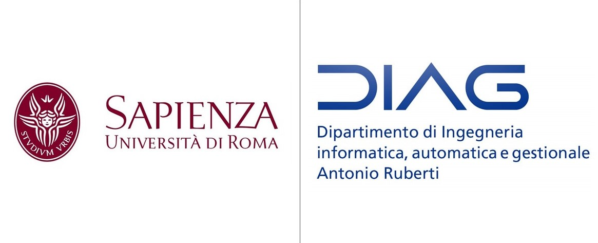

# University Projects

This repository contains the published projects during the academic years at [Università di Roma, La Sapienza](https://www.uniroma1.it/it/pagina-strutturale/home). The projects are grouped by course or by topic. You can find a list just below.

## Project list

This repository contains projects from the bachelor degree in [Ingegneria Informatica e Automatica](https://corsidilaurea.uniroma1.it/it/corso/2021/29931/home) and from the master degree in [Artificial Intelligence and Robotics](https://corsidilaurea.uniroma1.it/it/corso/2021/30431/home), both attended at the [DIAG](https://www.diag.uniroma1.it/) department.

### Bachelor degree projects

In the bachelor degree, the following projects are reported:
- **Laboratorio di Intelligenza Artificiale:** a set of homeworks about interacting with a robotic mobile base, executing a task, image processing, computer vision and planning using [Robot Operating System (ROS)](https://www.ros.org/) and C++, delivered during the second semester of the third year of the bachelor degree.
- **Metodi Quantitativi per l'Informatica:** a [TensorFlow](https://www.tensorflow.org/) project on Computer Vision where Neural Networks try to correctly recognize a wide set of traffic signs. A comparative analysis among networks is also discussed. The project was delivered at the end of the second semester of the third year of the bachelor degree.
- **Sistemi Operativi - Tesi Triennale:** project expanded also as final thesis about Simultaneous Localization And Planning (SLAM) in C language, where a robotic mobile base equipped with a camera aims to localize itself in and map the environemnt. The project exploits [AprilTag](https://april.eecs.umich.edu/software/apriltag) landmarks, [OpenCV](https://opencv.org/) and the [MARRtino](https://www.marrtino.org/) base from Sapienza. The project was delivered at the end of the second semester of the third year of the bachelor degree.

### Master degree projects

In the master degree, the following projects are reported:
- **Autonomous and Mobile Robotics:** a motion planning project that exploits the [Open Motion Planning Library (OMPL)](https://ompl.kavrakilab.org/) software package to plan stable trajectories for a car-trailer robotic system, especially in complex backward maneuvers. The project was delivered at the end of the first semester of the second year of the master degree.
- **Elective in Artificial Intelligence 2:** project with the humanoid robot [Pepper](http://labrococo.dis.uniroma1.it/?q=node/410) available at the DIAG Labs to build a teaching assistant framework to help users learn basketball. The work is based on a multi-medial Human-Robot Interaction exploiting an automated reasoning routine implemented in [PDDL](https://en.wikipedia.org/wiki/Planning_Domain_Definition_Language) and [Contingent Planning](https://fai.cs.uni-saarland.de/hoffmann/cff.html). The project was delivered at the end of the second semester of the second year of the master degree.
- **Interactive Graphics:** two homeworks centered on realizing basics of Computer Graphics like rendering a scene, shadowing, variable lighting and animations with [WebGL](https://get.webgl.org/). The final project is realized with the [BabylonJS](https://www.babylonjs.com/) framework and is a simplified re-implementation of the Mario Kart racing game from Nintendo.The homeworks and the project were delivered during and at the end of the second semester of the first year of the master degree.
- **Machine Learning:** project on Reinforcement Learning (RL) where a Neural Network aims to learn walking in a [OpenAI Gym MuJoCo](https://gym.openai.com/envs/#mujoco) environemnt with the exploitation of the Soft Actor-Critic (SAC) algorithm, one of the state-of-the-art methods in the RL field. The project was delivered during and at the end of the first semester of the first year of the master degree.
- **Natural Language Processing:** two homeworks on Word-in-Context Disambiguation (WiCD) and on Word Sense Disambiguation (WSD) using [PyTorch](https://pytorch.org/). The first homework uses Recurrent Neural Networks, like LSTMs and GRUs, that aims to understand whether a word shares the same semantic meaning in a pair of sentences. The second project is fully based on [BERT Transformers](https://huggingface.co/bert-base-uncased) trained to output the most likely semantic meaning of an ambiguous word occurring in a context. The homeworks were delivered during and at the end of the second semester of the first year of the master degree.
- **Neural Networks:** a Computer Vision project on Object Detection that exploits the [YOLO](https://pjreddie.com/darknet/yolo/) v3 architecture to understand the effects of the COVID-19 outbreak on the population in terms of pedestrian activity in public areas. The project first focuses on the city of Cracow and then expands the analysis to the most famous cities in Europe in a qualitative way. It was delivered at the end of the first semester of the first year of the master degree.
- **Planning and Reasoning:** a motion planning project that exploits the [Open Motion Planning Library (OMPL)](https://ompl.kavrakilab.org/) software package to plan trajectories for a simple disk robot, while comparing informed and uninformed searches with the usage of admissible heuristics to speed up and improve planning. The project was delivered at the end of the first semester of the second year of the master degree.
- **Vision and Perception:** a Computer Vision project based on [SinGAN](https://arxiv.org/abs/1905.01164), where the network first learns how to generate new random samples from a simple natural image such that each sample contains a different configuration of objects while preserving the visual content of the training image. Then the model focuses on the extreme case of faces, learns how to create realistic instances of human faces and how this can be used for face inpainting. The project was delivered at the end of the second semester of the first year of the master degree.

## Author

Lorenzo Nicoletti
